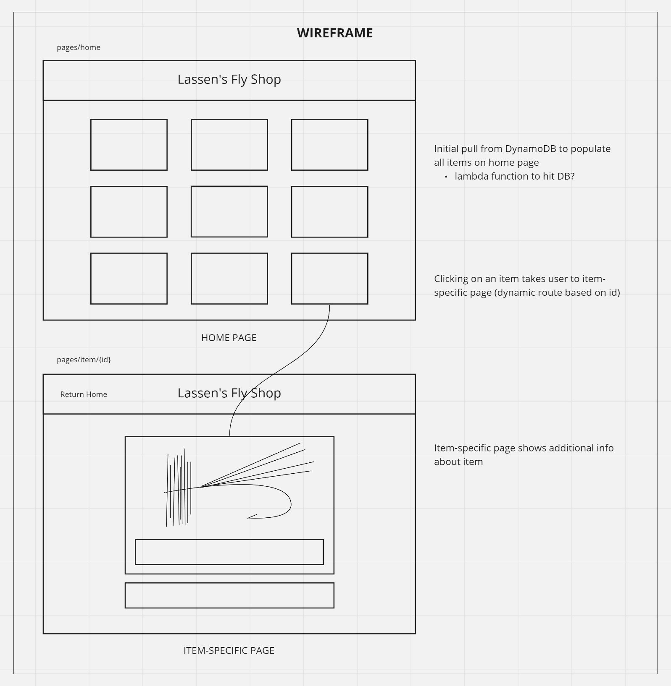
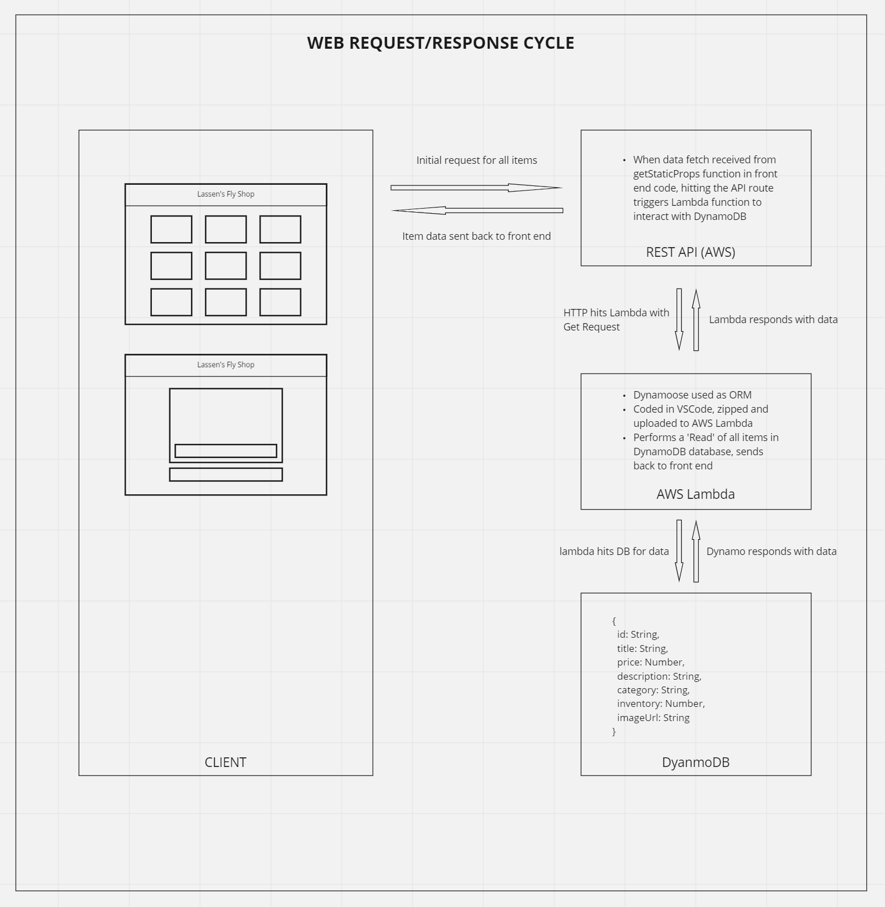

# Lassen's Fly Shop

## An eCommerce application built with Next.js and AWS

**Author:** Guy Farley

## How to Run This Application

Site is deployed @ <https://lassen-fly-shop.netlify.app>

## Problem Domain

The purpose of this simple eCommerce-style application is to deepen my understanding and skillset in two areas:

1. Use of the **Next.js** framework to build a frontend application. Primary goals:
    - Become familiar with navigation between *pages* using the `<Link>` component
    - Increase my knowledge of built-in support for CSS and Sass in Next.js
    - Make use of pre-rendering and data fetching
    - Implement dynamic routes to render an item-specific page based on user's selection

2. Use of specific **AWS** tools for data management on the backend. Primary goals:
    - To set up an HTTP API through which the frontend application can request data
    - To incorporate a Lambda function that will be triggered by frontend
    - To store and retreive data from a DynamoDB, sending data back to frontend application

## Features / Routes

- GET requests occur within the REST API, which trigger the Lambda function to retreive all item data from DynamoDB. This happens at buildtime, to ensure the browser does not handle the data fetch
- When a user clicks the name of one of the items on the home page, a dynamic route is created to render specific information on that item within a separate page. This includes a full description, pricing, and a larger photo of the item

## Challenges & Constraints

- **Challenge:** Fetching data from the AWS backend within the constraints of Next.js

  - Since components are pre-rendered in Next.js framework, this data fetch cannot happen in the browser. Instead, the data needs to be fetched at buildtime
  - This happens differently than it would in a standard React application. The data fetch needed to be called inside the getStaticProps function, which runs at buildtime
  - At this point, the data that is sent back from AWS is captured in an object and passed along as props to the Home page (component) for rendering

- **Challenge:** Uploading the Lambda function as a zipped package of files

  - Since Dynamoose is a 3rd party ORM and not an AWS program, it needs to be brought in and therefore contributes to a file size of the Lambda function that requires it to be zipped and uploaded (rather than written directly into the AWS code source)
  - To achieve this, I needed to write the function in VSCode, then zip it up with its package.json and node modules to be uploaded to AWS for use

- **Challenge:** Incorporating state via the `useContext` hook

  - As the app was constructed with Next.js to pre-render data using `getStaticProps`, I needed to figure out how to manage state in combination with this pre-rendering. It took a while to wrap my head around when the data needed to be added to state, and how to use that state throughout the app after initial page load.
  - To manage this, I decided to use conditional statements to evaluate if data yet existed in global state. If so, the page would render that data. If not, the page would use the data pulled from DynamoDB when `getStaticProps` was executed

- **Challenge:** Incorporating Material UI with Next.js

  - Here I leaned heavily on [this article](https://www.geeksforgeeks.org/how-to-use-material-ui-with-next-js/) found on geeksforgeeks.org
  - Quite a bit of code needed to be added to my app to allow for Material UI to be used without interfering with the Next.js functionality. This required the creation and/or updating of the following files:
    - `/pages/_document.js`
    - `/src/theme.js`
    - `/src/createEmotionCache.js`
    - `/pages/_app.js`
  - While I was hesitant to rely so heavily on this additional code, I felt it was worth it to polish up my application visually and to add the table component into my shopping cart so it would display as I envisioned it

## Visual Documentation

### Wireframe

Before determining the data flow of my application, I first created a wireframe to help visualize how the final application would appear to the end user. This was the first step in determining how the app would function, as it required me to think through the user's experience and how they would be best served by the architecture.

It was at this point that I decided it would be best to pull data for all fly items from the database upon initial page load (I did not yet realize it needed to happen before initial page load) so that the data would be available for pre-rendering of the item-specific pages. This would ensure the information (including photos) would be locked and loaded to ensure the user would not need to wait for that data to load when they visited each item's specific page.

This also ensured that the API would only need to be hit once during the user's visit, which would help keep costs down.

### Web Request/Response Cycle

I wanted to build a backend server that existed entirely on AWS. To achieve this, I would need to make use of the following **AWS** services:

- **API Gateway** - Here I would create a GET method to handle the fetch call, which was happening inside the getStaticProps() function in the frontend code
- **Lambda function** - When the API route was hit, it would trigger this Lambda function. The Lambda would perform a READ operation pull all data from the DynamoDB table where all fly items existed
- **DynamoDB** - The Lambda would interact with DynamoDB via Dynamoose (a 3rd party ORM). A model would be created to represent the fly items held in the database, then the Lambda would use the scan() and exec() methods to read the data. The data would need to be JSON stringified before being sent back to the browser for rendering

## Links and Resources

Wireframing and Web Request/Response Cycle: <https://miro.com/app/board/uXjVPbIEoBA=/?share_link_id=781844634355>

<https://nextjs.org/docs/getting-started>

<https://docs.aws.amazon.com/apigateway/latest/developerguide/http-api-dynamo-db.html>

<https://www.youtube.com/watch?v=zueyEdRZQlk>

<https://www.geeksforgeeks.org/how-to-use-material-ui-with-next-js/>
